# Loka Cash — 链上/链下架构 & 现金流资金管理

> **目的**：明确哪些功能上链、哪些走传统模式，以及现金流资产如何保证还款和资金安全

---

## 1. 链上 vs 链下 总览

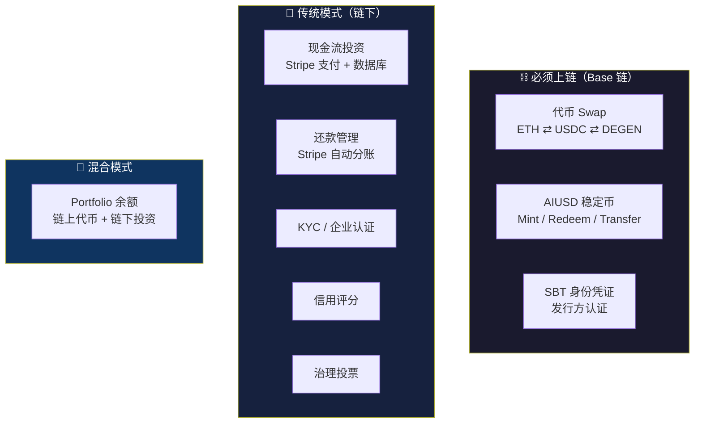

### 对比表

| 功能 | 模式 | 原因 | 技术方案 |
|------|:----:|------|---------|
| **代币 Swap** | ⛓️ 链上 | 本质是链上资产交换，必须调用 DEX 合约 | 0x / 1inch API + Privy 钱包签名 |
| **AIUSD 铸造/赎回** | ⛓️ 链上 | ERC-20 代币的 mint/burn 是链上操作 | AIUSD 合约 + USDC approve |
| **SBT 发行方认证** | ⛓️ 链上 | 不可转让的身份凭证，需链上不可篡改 | ERC-5192 (Soulbound) |
| **现金流投资** | 🏦 链下 | 传统金融投资，用法币/稳定币支付即可 | Stripe Connect + 数据库 |
| **还款 & 分账** | 🔄 混合 | Web2 走 Stripe；Web3 走链上分账合约 | Stripe Connect / Revenue Splitter 合约 |
| **KYC / 企业认证** | 🏦 链下 | 身份验证是传统服务 | Sumsub / Onfido API |
| **信用评分** | 🏦 链下 | 内部评分系统，无需公开上链 | 后端 service + DB |
| **治理投票** | 🏦 链下 | 当前阶段链下足够，v2 可上链 | 后端 API + DB |
| **Portfolio 余额** | 🔄 混合 | 代币余额需链上查询，投资记录在链下 | ethers.js + DB |

> [!IMPORTANT]
> **结论**：核心上链功能 — 代币 Swap、AIUSD、SBT + Web3 企业分账合约。
> Web2 企业走 Stripe Connect，Web3 企业走链上分账合约，两条路径并行。

---

## 2. 现金流资产 — 资金管理机制

### 2.1 核心问题

> 用户把钱投给商家，**怎么保证商家按时还钱？** 如果商家不还怎么办？

### 2.2 解决方案：Stripe Connect 自动分账 + 资金托管

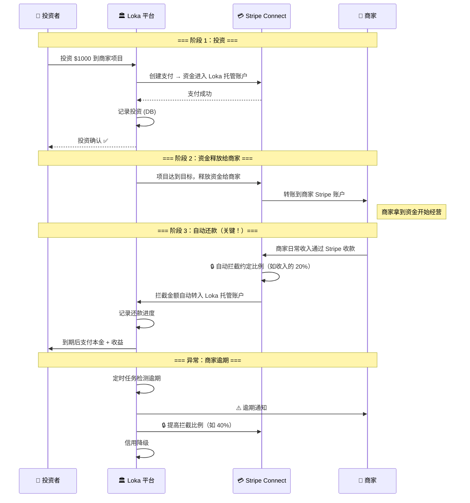

### 2.3 关键机制详解

#### 🔒 机制 1：Stripe Connect 自动分账（Revenue Splitting）

> **核心思路**：商家通过 Stripe 收款时，平台自动从每笔收入中抽走约定比例用于还款。

**工作原理：**
- 商家接入 Stripe Connect 并授权 Loka 为其平台账户
- 商家的每笔收入，Stripe **自动** 按比例拆分：
  - 80% → 商家自己的账户
  - 20% → Loka 平台的托管账户（用于偿还投资者）
- 商家 **无法** 阻止这个分账，因为钱先经过 Stripe 再到商家

```
商家客户付款 $100
    ↓
Stripe 收到 $100
    ├── $80 → 商家账户
    └── $20 → Loka 托管账户 → 累积还款 → 到期支付给投资者
```

**Stripe API 实现：**
```javascript
// 创建 Connected Account（商家注册时）
const account = await stripe.accounts.create({
  type: 'express',
  country: 'US',
  capabilities: { transfers: { requested: true } },
});

// 商家收款时自动分账
const paymentIntent = await stripe.paymentIntents.create({
  amount: 10000, // $100
  currency: 'usd',
  application_fee_amount: 2000, // 平台抽取 $20（用于还款）
  transfer_data: {
    destination: merchantStripeAccountId,
  },
});
```

#### 🏦 机制 2：资金托管（Escrow）

| 阶段 | 资金位置 | 控制方 |
|------|---------|--------|
| 投资者付款 | Loka 平台 Stripe 账户 | Loka |
| 项目募资中 | Loka 托管账户（Stripe） | Loka |
| 项目达标 | 释放给商家 | 商家 |
| 商家还款中 | 从商家收入自动拦截 → Loka 托管 | Loka |
| 投资到期 | Loka 托管账户 → 投资者 | Loka → 投资者 |

> [!TIP]
> 关键点：**资金在整个生命周期内，大部分时间都在 Loka 控制的 Stripe 托管账户中**。
> 投资者的钱不是直接给商家，而是通过 Stripe 中间托管。

#### ⚡ 机制 3：收入验证 & 风控

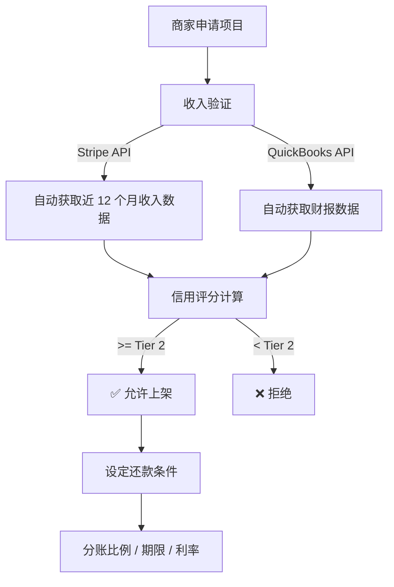

**商家准入条件：**
- Stripe 连续 6+ 个月有稳定收入
- 月均收入 >= 还款金额的 3 倍
- 通过 KYC / UBO 检查
- 信用评分 Tier 2 及以上

#### 🛡️ 机制 4：违约保护（多层防御）

| 防御层 | 机制 | 说明 |
|--------|------|------|
| **第 1 层** | 收入自动拦截 | Stripe 自动从商家每笔收入中扣除还款，商家无法阻止 |
| **第 2 层** | 超额拦截 | 逾期后自动提高拦截比例（20% → 40%） |
| **第 3 层** | 信用降级 | 逾期降信用分 → 影响未来融资能力 |
| **第 4 层** | 抵押品清算 | 项目方预缴 **10-30%** 抵押品（比例由信用等级决定），违约时扣押并清算赔付投资者 |
| **第 5 层** | 法律追索 | 投资合同 + UCC-1 抵押品登记有法律效力，可诉讼追偿 |
| **第 6 层** | 平台兜底基金（可选） | 平台从手续费中提取部分作为风险储备金 |

> [!WARNING]
> 如果商家完全停止使用 Stripe 收款（跑路），第 1-2 层失效。
> 此时需要第 4-6 层：抵押品清算 + 法律追索 + 平台兜底。
> **这是最大风险点**，需要法律合同 + 抵押品机制双重保障。

---

## 2.4 抵押品管理机制 (Collateral Management)

> **核心原则**：项目方必须在发起募资时提供一定比例的抵押品，抵押率由信用等级决定。抵押品在项目存续期间锁定，全额还清后释放，违约时扣押清算。

### 2.4.1 抵押品类型

| 类型 | 枚举值 | 说明 | 估值方式 |
|------|--------|------|----------|
| 实物资产 | `physical_asset` | GPU 矿机、服务器等硬件设备 | 市场评估价 × 折旧系数 |
| 应收账款 | `receivable` | 已签署的客户合同、未结清发票 | 合同金额 × 回收概率 |
| 保证金存款 | `deposit` | USDC/USDT 等链上稳定币存款 | 1:1 面值 |
| 知识产权质押 | `ip_lien` | 专利、商标、软件著作权 | 第三方估值 |

### 2.4.2 抵押率与信用等级挂钩

| 信用等级 | 信用分 | 抵押率 | 说明 |
|---------|:------:|:------:|------|
| **新秀 (Tier 1)** | 200 分 | **30%** | 新项目方风险高，需高抵押 |
| **成长 (Tier 2)** | 500 分 | **10%** | 已有良好还款记录 |
| **蓝筹 (Tier 3)** | 1000 分 | **10%** | 长期信誉优秀 |

> [!TIP]
> **示例**：新秀项目方募资 $100,000，需抵押价值 $30,000 的资产。
> 成长/蓝筹项目方募资同样金额，只需抵押 $10,000。

### 2.4.3 抵押品生命周期

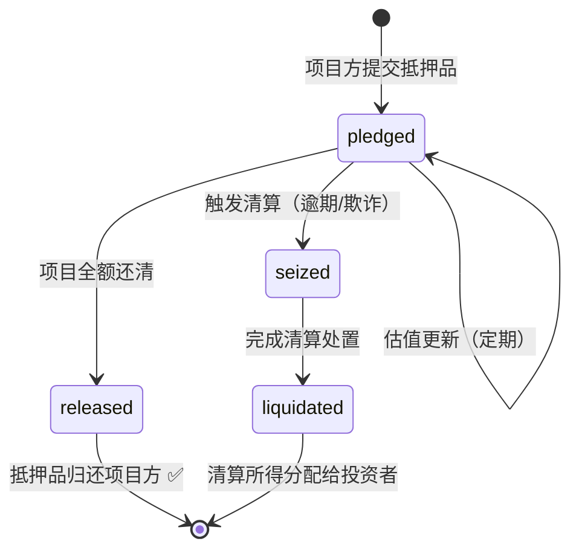

| 状态 | 含义 | 触发条件 |
|------|------|----------|
| `pledged` | 已质押锁定 | 项目发起时提交 |
| `seized` | 已扣押 | 触发清算后系统自动扣押 |
| `liquidated` | 已清算完成 | 清算处置完毕 |
| `released` | 已释放 | 所有还款完成，项目状态 `completed` |

### 2.4.4 数据模型（已实现）

```prisma
model Collateral {
  id          String   @id @default(cuid())
  projectId   String
  type        String   // physical_asset, receivable, deposit, ip_lien
  description String
  value       Float
  status      String   @default("pledged") // pledged, seized, liquidated, released
  createdAt   DateTime @default(now())
  updatedAt   DateTime @updatedAt

  project          Project            @relation(fields: [projectId], references: [id])
  liquidationEvents LiquidationEvent[]
}
```

---

## 2.5 收入分账机制 — Web2 vs Web3 双轨制

> **核心思路**：根据项目方的业务类型，选择最合适的收入拦截方式。Web2 企业走 Stripe，Web3 企业走链上合约，混合企业可以两者结合。

### 2.5.1 三种分账模式对比

| 模式 | 适用企业 | 分账方式 | 强制性 | 透明度 |
|------|---------|---------|:------:|:------:|
| **Stripe Connect** | Web2（SaaS、电商等） | Stripe API 自动拦截收入 | ⭐⭐⭐ 平台强制 | 链下 |
| **链上分账合约** | Web3 原生（DeFi、NFT、链上 SaaS） | 智能合约代码强制拆分 | ⭐⭐⭐⭐⭐ 代码强制 | 链上透明 |
| **混合模式** | Web2 + 链上托管 | Stripe 收入 → USDC → 链上合约 | ⭐⭐⭐⭐ 混合强制 | 最后一公里上链 |

### 2.5.2 Web3 企业 — 链上分账合约 (Revenue Splitter)

> Web3 企业的收入本身就在链上（协议费、NFT 版税、链上服务费），可以部署**不可篡改的分账合约**，这是最强的还款保障。

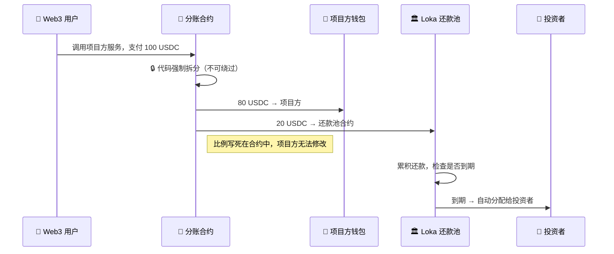

**核心优势 vs Stripe：**

| 对比维度 | Stripe Connect | 链上分账合约 |
|---------|----------------|-------------|
| 执行方 | Stripe 公司 | 智能合约代码 |
| 可绕过 | 商家可停用 Stripe（跑路） | ❌ 不可绕过，除非放弃整个业务 |
| 透明度 | 需信任 Stripe 数据 | 链上公开验证 |
| 实时性 | 每笔结算后 T+2 | 每笔交易即时拆分 |
| 适用范围 | 法币收入 | 链上收入 |

**分账合约伪代码：**

```solidity
// Revenue Splitter — Loka 部署，项目方必须将此合约设为收款地址
contract RevenueSplitter {
    address public merchant;      // 项目方钱包
    address public lokaPool;      // Loka 还款池
    uint256 public splitBps;      // 分账比例 (如 2000 = 20%)
    bool public locked;           // 还款期间锁定，不可修改

    // 项目方的所有收入都先进此合约
    function receive() external payable {
        uint256 lokaShare = msg.value * splitBps / 10000;
        uint256 merchantShare = msg.value - lokaShare;

        payable(lokaPool).transfer(lokaShare);      // 自动转入还款池
        payable(merchant).transfer(merchantShare);   // 剩余给项目方
    }

    // ERC-20 代币收入同理
    function splitToken(IERC20 token, uint256 amount) external {
        token.transferFrom(msg.sender, address(this), amount);
        uint256 lokaShare = amount * splitBps / 10000;
        token.transfer(lokaPool, lokaShare);
        token.transfer(merchant, amount - lokaShare);
    }
}
```

**适用的 Web3 项目类型：**

| 项目类型 | 收入来源 | 分账方式 |
|---------|---------|----------|
| DeFi 协议 | 交易手续费、借贷利差 | 合约级拆分 |
| NFT 平台 | 铸造费、版税 | Royalty Splitter |
| 链上 SaaS | API 调用费（按次付费） | 收款地址 = 分账合约 |
| AI 算力市场 | GPU 租赁费 | 订单结算合约拆分 |
| GameFi | 游戏内购、NFT 交易 | 合约级拆分 |

### 2.5.3 Web2 企业 — 混合模式（Stripe → USDC → 链上合约）

> Web2 企业的法币收入无法直接被智能合约触达，但可以通过**自动换汇桥**将最后一公里上链。

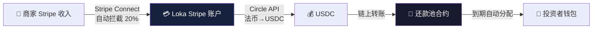

**流程：**
1. Stripe Connect 从商家收入中自动拦截约定比例（与纯 Web2 方案相同）
2. 拦截的法币通过 **Circle API** 或 **Bridge** 自动兑换为 USDC
3. USDC 转入链上还款池合约
4. 投资者能在链上验证还款记录

**换汇桥选型：**

| 服务 | 功能 | 费用 | 到账 |
|------|------|:----:|:----:|
| **Circle** | USD → USDC（官方兑换） | 0% | T+1 |
| **Bridge (by Stripe)** | 法币 ⇄ 稳定币 API | 0.1% | T+0~T+1 |
| **MoonPay** | 法币 → 加密货币 | 1-2% | 即时 |

> [!TIP]
> **推荐 Circle**：零费率，且 Stripe 和 Circle 有深度合作。
> Stripe 2025 年收购 Bridge 后，Stripe → USDC 的桥接会更原生。

### 2.5.4 项目申请时的分账方式选择

在项目方申请流程（§8）中，根据业务类型自动匹配分账方式：

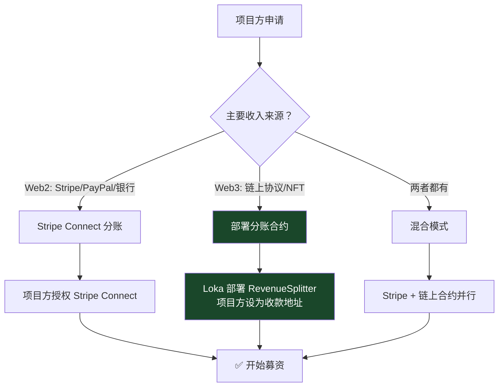

---

## 3. 投资生命周期

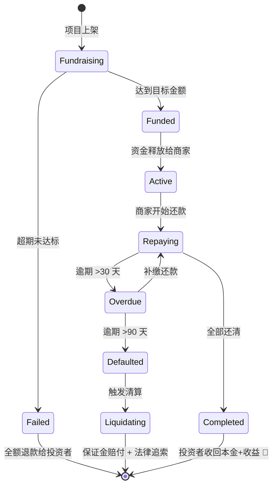

### 各阶段资金流向

| 阶段 | 投资者 → | → 平台 | → 商家 | 说明 |
|------|:--------:|:------:|:------:|------|
| **募资中** | $1000 出 | $1000 进（托管） | $0 | 钱在平台托管 |
| **达标释放** | — | $1000 出 | $1000 进 | 释放给商家使用 |
| **还款中** | — | 每月自动收 | 每月被扣 | Stripe 自动分账 |
| **到期结算** | $1185 进 | $1185 出 | — | 本金$1000 + 收益$185 |
| **违约清算** | 抵押品赔付 | 扣押并清算抵押品 | 黑名单 | 瀑布分配算法启动 |

---

## 3.1 清算机制详解 (Liquidation)

> **目标**：当项目方违约时，通过标准化的瀑布分配算法，最大限度保护投资者权益。

### 3.1.1 清算触发条件

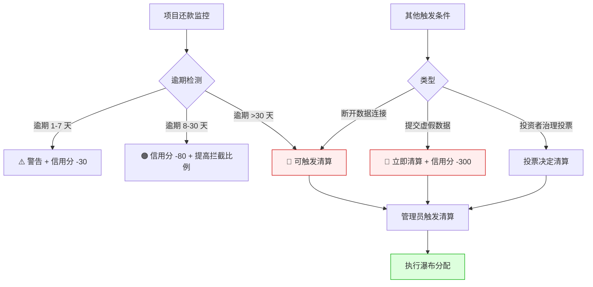

| 触发原因 | 枚举值 | 信用扣分 | 说明 |
|---------|--------|:--------:|------|
| 逾期 >30 天 | `overdue_30` | -150 | 多次逾期未还 |
| 逾期 >90 天 | `overdue_90` | -150 | 长期违约 |
| 欺诈/虚假数据 | `fraud` | -300 | 永久封禁 |

### 3.1.2 两种清算路径

| 路径 | 适用场景 | 决策方 | 流程 |
|------|---------|--------|------|
| **立即清算** | 恶意跑路、虚假数据、彻底破产 | 管理员直接触发 | 扣押抵押品 → 瀑布分配 → 赔付投资者 |
| **协商重组** | 暂时现金流困难，仍有经营 | 投资者治理投票 | 发起提案 → 投票选择方案 → 按投票结果执行 |

**协商重组投票方案：**

| 方案 | 说明 |
|------|------|
| A. 延期还款 | 降低每月还款额，延长周期 |
| B. 全额收入锁定 | 项目方收入 100% 用于还款 |
| C. 追加抵押品 | 项目方补充更多抵押物 |
| D. 立即清算 | 终止项目，执行清算 |

### 3.1.3 瀑布分配算法（已实现）

> **核心逻辑**：按优先级从高到低分配可回收资金。高优先级债权人先获得赔付，剩余部分流向下一层。

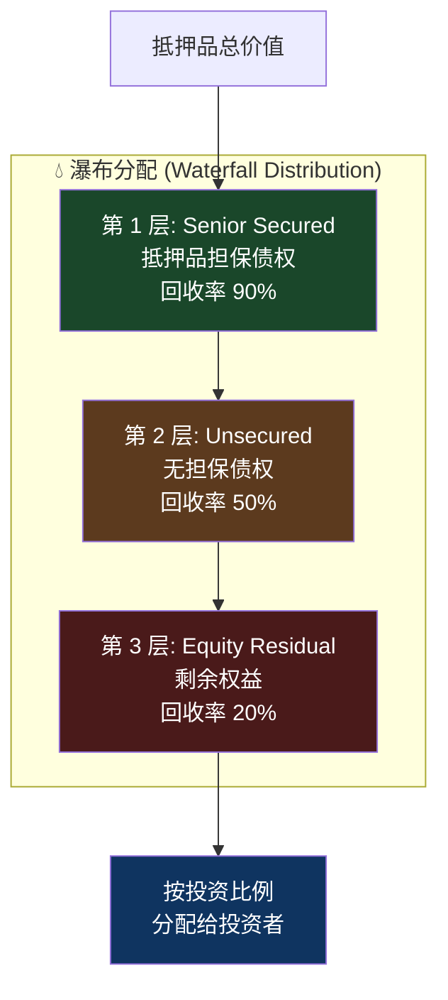

**三层回收率：**

| 层级 | 标签 | 回收率 | 计算方式 |
|:----:|------|:------:|----------|
| 1 | Senior Secured (抵押品担保) | **90%** | `min(抵押品价值 × 0.90, 未偿债务)` |
| 2 | Unsecured (无担保债权) | **50%** | `(剩余抵押品价值) × 0.50` |
| 3 | Equity Residual (剩余权益) | **20%** | 几乎不产生回收 |

**计算示例：**

```
项目融资 $100,000，逾期 30 天触发清算
抵押品总价值：$30,000（新秀 30% 抵押率）
未偿债务：$80,000

第 1 层 (Senior): min($30,000 × 0.90, $80,000) = $27,000
第 2 层 (Unsecured): ($30,000 - $27,000) × 0.50 = $1,500
第 3 层 (Equity): $0

总回收：$28,500 / $80,000 = 35.6% 回收率
→ 按投资者持仓比例分配 $28,500
```

### 3.1.4 清算执行流程（已实现）

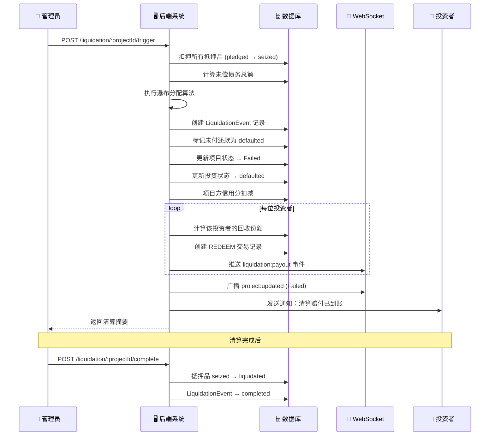

### 3.1.5 数据模型（已实现）

```prisma
model LiquidationEvent {
  id              String   @id @default(cuid())
  projectId       String
  collateralId    String?       // 关联的抵押品
  triggerReason   String        // overdue_30, overdue_90, fraud
  recoveredAmount Float    @default(0)  // 该项抵押品的回收金额
  status          String   @default("initiated") // initiated → in_progress → completed/cancelled
  waterfallTier   String?       // senior, unsecured, equity
  createdAt       DateTime @default(now())
  updatedAt       DateTime @updatedAt

  project    Project     @relation(fields: [projectId], references: [id])
  collateral Collateral? @relation(fields: [collateralId], references: [id])
}
```

### 3.1.6 API 端点

| 方法 | 路径 | 说明 | 权限 |
|------|------|------|------|
| `GET` | `/liquidation/:projectId/collateral` | 查询项目抵押品列表 | 公开 |
| `POST` | `/liquidation/:projectId/collateral` | 添加抵押品 | 登录 |
| `GET` | `/liquidation/:projectId/events` | 查询清算事件列表 | 公开 |
| `GET` | `/liquidation/:projectId/summary` | 清算摘要（债务/抵押品/回收估算） | 公开 |
| `POST` | `/liquidation/:projectId/trigger` | 触发清算 | 管理员 |
| `POST` | `/liquidation/:projectId/complete` | 完成清算 | 登录 |

### 3.1.7 定时任务联动

后端 `scheduler.service.ts` 每小时自动检测逾期还款：

```
定时任务（每小时） → 扫描 overdue 还款
    ├── 标记逾期状态 (upcoming → overdue)
    ├── 信用分扣减（-30 / -80 / -150）
    ├── 通知投资者
    └── 逾期 >30 天的项目 → 管理员可触发清算
```

> [!IMPORTANT]
> **自动检测 vs 手动触发**：逾期检测是自动的（定时任务），但清算执行需要管理员手动触发。
> 这是有意设计 — 给项目方一个缓冲窗口，也允许通过治理投票进行协商重组。

---

## 4. 技术实现清单

### 4.1 必须上链的（3 项）

| 功能 | 合约类型 | 难度 | 说明 |
|------|---------|:----:|------|
| 代币 Swap | 不需自己写，调用 DEX | 🟡 中 | 集成 0x/1inch API |
| AIUSD | ERC-20 + Mint/Burn 权限 | 🟡 中 | 标准 ERC-20 + owner mint |
| SBT | ERC-5192 Soulbound | 🟢 低 | 简单的不可转让 NFT |

### 4.2 传统模式的（核心业务）

| 功能 | 技术方案 | 当前状态 | 差距 |
|------|---------|:--------:|------|
| 投资支付 | Stripe Checkout | ❌ 未对接 | 需申请 Stripe Connect |
| 自动分账 | Stripe Connect 分账 | ❌ 未对接 | 核心功能，需开发 |
| 资金托管 | Stripe 平台账户 | ❌ 未对接 | Stripe 自带 |
| 收入验证 | Stripe API 读取商家数据 | ❌ 未对接 | 需 OAuth 授权 |
| 还款追踪 | 后端定时任务 | ✅ 已完成 | DB 逻辑已有 |
| 逾期检测 | 后端定时任务 | ✅ 已完成 | 自动检测 |
| 信用评分 | 后端 service | ✅ 已完成 | 3 级体系 |
| 清算算法 | 后端 service | ✅ 已完成 | 瀑布分配 |

### 4.3 优先级排序

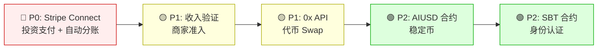

---

## 5. AIUSD 稳定币 — 技术落地方案


### 5.1 产品定位

**AIUSD = 国债支持的支付型稳定币**

- 用户存入 USDT/USDC → 协议用 85% 购买链上国债 → 1:1 铸造 AIUSD
- 用户 **不享有** 国债利息 → 利息归协议（核心收入来源）
- 赎回时 1:1 销毁 AIUSD → 返还 USDT/USDC

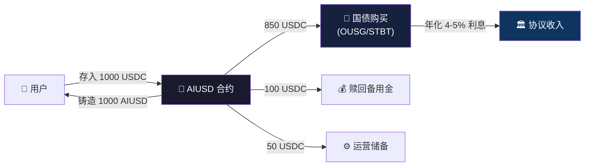

### 5.2 资金分配模型

| 资金去向 | 比例 | 用途 |
|---------|:----:|------|
| 链上国债代币 | 85% | 购买 OUSG (Ondo) / STBT (Matrixdock) 等短期美债 ETF |
| 赎回备用金 | 10% | 热钱包，覆盖日常小额赎回 |
| 运营储备 | 5% | Gas 费、应急流动性 |

### 5.3 铸造与赎回流程

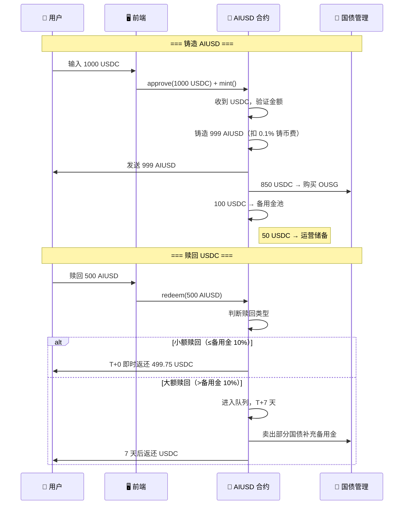

### 5.4 赎回分层机制

| 赎回类型 | 条件 | 到账时间 | 费用 |
|---------|------|:--------:|:----:|
| 小额即时赎回 | ≤ 备用金 10% | T+0 即时 | 0.05% |
| 普通赎回 | ≤ 备用金 50% | T+0 ~ T+1 | 0.05% |
| 大额赎回 | > 备用金 50% | T+7 天 | 0（无额外费用） |
| 超大额赎回 | > 备用金 80% | T+7 分 3 期 | 0 |

> [!WARNING]
> **赎回挤兑防护**：当备用金 < 20% 时，自动触发大额赎回延迟。
> 同时协议从国债端快速变现补充备用金。

### 5.5 国债购买策略

**选型对比**：

| 标的 | 发行方 | 底层资产 | 年化 | 赎回 | 适合 |
|------|--------|---------|:----:|:----:|------|
| **OUSG** | Ondo Finance | 短期美债 ETF (SHV) | ~5% | T+1 | ✅ 首选 |
| **STBT** | Matrixdock | 6 月内美债 | ~4.8% | T+2 | ✅ 分散 |
| **USDY** | Ondo Finance | 国债+活期存款 | ~5.2% | T+1 | 备选 |
| **BUIDL** | BlackRock | 美债基金 | ~4.5% | T+0 | 机构级 |

**风控规则**：
- 单一标的持仓 ≤ 30%（分散风险）
- 仅购买 1-3 个月期短期国债（确保流动性）
- 最低抵押率 120%（国债市值 / AIUSD 发行量）
- 抵押率 < 110% → 自动卖出国债补充备用金
- 抵押率 < 105% → 熔断，暂停铸造

### 5.6 收入模型

> [!NOTE]
> AIUSD 的核心商业模式：**用户 0 利息持有，协议吃全部国债利差**

| 收入来源 | 计算方式 | 占比 |
|---------|---------|:----:|
| 国债利息 | TVL × 5% 年化 × 85%（国债占比） | ~90% |
| 铸币费 | 铸造金额 × 0.1% | ~8% |
| 赎回费 | 赎回金额 × 0.05% | ~2% |

**收入估算（按 TVL）**：

| TVL | 国债利息/年 | 铸币费/年 | 总收入/年 |
|:---:|:----------:|:--------:|:--------:|
| $1M | $42,500 | $5,000 | ~$47,500 |
| $10M | $425,000 | $50,000 | ~$475,000 |
| $100M | $4,250,000 | $500,000 | ~$4,750,000 |

### 5.7 智能合约架构

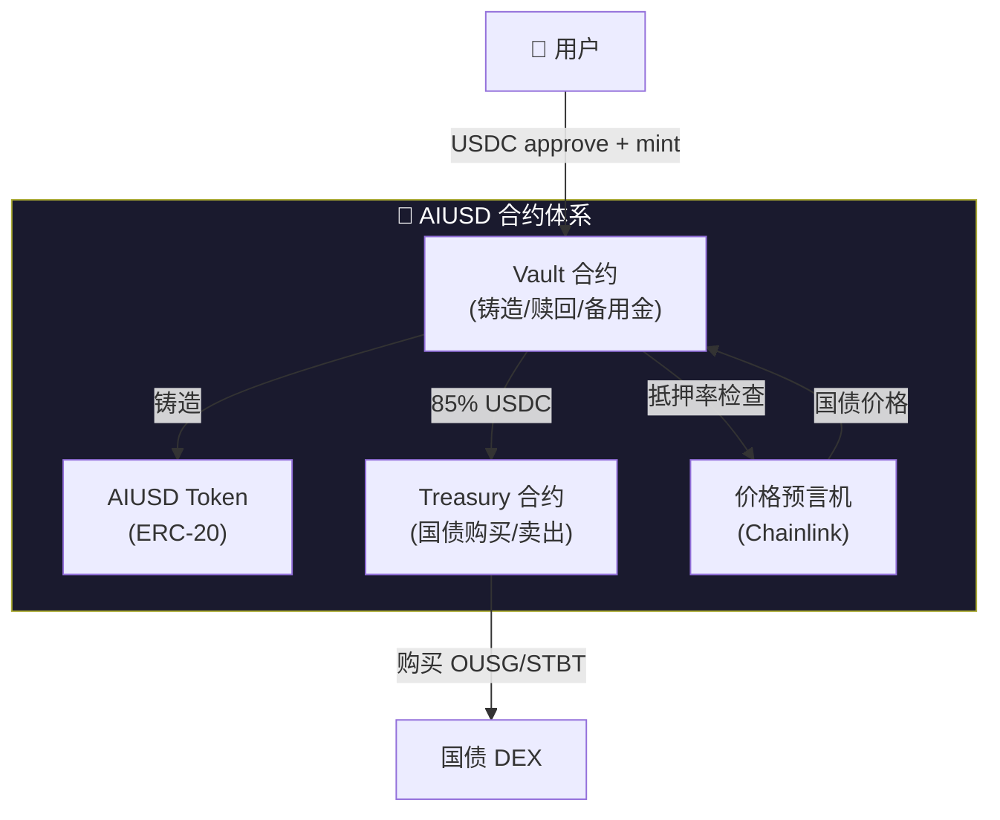

**合约清单**：

| 合约 | 职责 | 标准 | 复杂度 |
|------|------|------|:------:|
| `AIUSD.sol` | ERC-20 代币，仅 Vault 可 mint/burn | ERC-20 + AccessControl | 🟢 低 |
| `AIUSDVault.sol` | 铸造/赎回逻辑，备用金管理，赎回队列 | 自定义 | 🟡 中 |
| `Treasury.sol` | 国债代币购买/卖出，抵押率监控 | 自定义 | 🟡 中 |
| `RedemptionQueue.sol` | 大额赎回排队，T+7 兑付 | 自定义 | 🟡 中 |

### 5.8 前端页面（已有 UI，需对接合约）

| 页面 | 当前状态 | 需要对接 |
|------|:--------:|---------|
| 铸造页面 (Deposit) | ✅ UI 完成 | 合约 approve + mint |
| 赎回页面 | ✅ UI 完成 | 合约 redeem + 队列展示 |
| 储备金仪表盘 | ❌ 未实现 | 合约读取抵押率/备用金/国债持仓 |
| 赎回队列展示 | ❌ 未实现 | 大额赎回排队状态 |

### 5.9 AIUSD 开发路线图

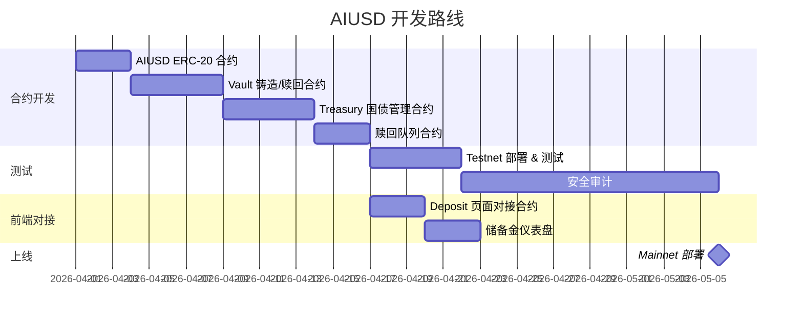

### 5.10 AIUSD 技术待办

| 事项 | 负责 | 优先级 | 依赖 |
|------|:----:|:------:|------|
| AIUSD ERC-20 合约编写 | AI + 合约开发 | 🟡 P1 | — |
| Vault 合约（铸造/赎回/备用金） | AI + 合约开发 | 🟡 P1 | AIUSD 合约 |
| Treasury 合约（国债购买） | AI + 合约开发 | 🟡 P1 | Vault 合约 |
| 对接 Ondo Finance OUSG API | AI | 🟡 P1 | Treasury 合约 |
| Chainlink 价格预言机集成 | AI | 🟡 P1 | — |
| Testnet 部署 + 测试 | AI | 🟡 P1 | 合约完成 |
| 前端 Deposit 页面对接 | AI | 🟡 P1 | Testnet |
| 储备金仪表盘前端 | AI | 🟢 P2 | Testnet |
| 合约安全审计 | 👤 | 🔴 P0 | 合约完成 |
| Mainnet 部署 | 👤 + AI | 🔴 P0 | 审计通过 |
| 法律声明（非理财产品免责） | 👤 | 🔴 P0 | — |

> [!IMPORTANT]
> **用户无利息声明**：必须在 UI 醒目位置展示：
> "AIUSD 是支付型稳定币，100% 由美国国债支持。持有 AIUSD 不产生利息，底层国债全部利息归 LOKA 协议所有，作为提供稳定币服务的对价。"

---

## 6. 总结

> [!NOTE]
> **核心发现**：Loka Cash 的主营业务（现金流投资）**完全不需要链上合约**。
> 通过 Stripe Connect 就能实现：投资支付、资金托管、自动还款、收入拦截。
>
> 链上部分（Swap / AIUSD / SBT）是增值功能，可以分阶段上线：
> - **Phase 1（MVP）**：现金流投资（Stripe） + AI Chat
> - **Phase 2**：AIUSD 稳定币（国债支持）
> - **Phase 3**：代币 Swap + SBT + PT/YT 结构化产品

**MVP 上线只需要：**
1. ✅ 已有：后端投资/还款/信用评分逻辑
2. 🔴 需要：Stripe Connect 对接（支付 + 分账 + 托管）
3. 🔴 需要：部署 + 域名
4. 🟡 Phase 2：AIUSD 合约 + 国债对接
5. 🟡 Phase 3：代币 Swap + PT/YT

**你需要做的：**
1. 申请 Stripe Connect 平台账号
2. 准备真实的商家项目
3. 法律合同模板（投资协议 + 还款承诺 + AIUSD 免责声明）
4. 提供服务器 + 域名
5. 对接 Ondo Finance（OUSG 购买渠道）
6. 合约审计预算
