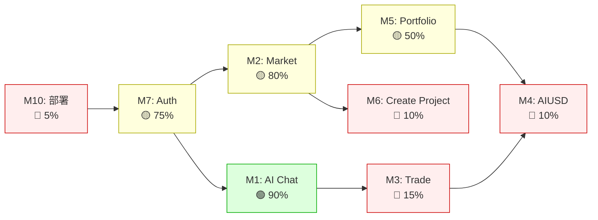
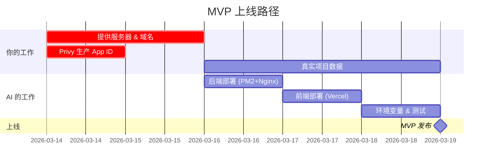

# 🚀 Loka Cash — 项目进度 & 上线追踪

> **最后更新**：2026-03-18 · **整体代码进度**：~87% · **上线就绪**：~43%

> [!IMPORTANT]
> Phase 0-11 核心代码完成，本地可完整运行（前端 :3000 + 后端 :3002）。
> 距离真实上线主要差：**智能合约**、**生产部署**、**第三方服务接入**。

---

## 📊 上线路径总览

---

## 📋 模块上线总览

| 模块 | 子功能 | ✅ | ⚠️ | ❌ | 就绪度 | 主要阻塞 |
|------|:------:|:--:|:--:|:--:|:------:|---------|
| **M1** AI Chat | 8 | 7 | 1 | 0 | 🟢 90% | AI 生产额度 |
| **M2** Market | 15 | 9 | 2 | 4 | 🟡 65% | Stripe 对接 + Pledge Box + 实时倒计时 |
| ~~M3 Trade~~ | — | — | — | — | 🚫 已移除 | 代币交易功能已砍掉 |
| **M4** AIUSD | 6 | 0 | 2 | 4 | 🔴 15% | ERC-20 合约 |
| **M5** Portfolio | 6 | 3 | 2 | 1 | 🟡 55% | 链上余额 |
| **M6** Create Project | 7 | 0 | 2 | 5 | 🔴 15% | 前端 UI + 第三方 |
| **M7** Auth | 9 | 7 | 1 | 1 | 🟡 83% | Privy 生产 + KYC |
| **M8** Groups | 9 | 7 | 1 | 1 | 🟡 75% | 前端对接后端 API |
| **M9** 信用/还款/清算 | 6 | 1 | 0 | 5 | 🔴 25% | 前端 UI + 合约 |
| **M10** 部署 | 7 | 1 | 0 | 6 | 🔴 5% | 服务器 + 域名 |

> [!TIP]
> **MVP 最小上线集**：M7(Auth) + M10(部署) + M1(仅聊天) + M2(仅浏览)
> **你需要提供**：服务器、域名、Privy 生产 ID、真实项目数据

**图例**：✅ 真实可用 · ⚠️ 部分真实 · ❌ 假数据/未实现 · 🚫 功能缺失

---

## 🔍 模块功能明细

### M1: AI Chat（AI 聊天）

> Chat 本身不涉及链上操作。投资的链上执行属于 M4(AIUSD)、M2(Market) 的职责，Chat 只负责意图识别和生成交易卡片。
> 代币交易（Token Swap）已从聊天中移除，用户需通过 Trade 页面操作。

| 子功能 | UI | 后端 | 说明 |
|--------|:--:|:----:|------|
| 自然语言聊天 | ✅ | ✅ | 真实 AI（deepseek-v3），SSE 流式 |
| 聊天历史 | ✅ | ✅ | DB 持久化，sessionId 会话分组，支持加载/删除/新建 |
| @选中资产上下文 | ✅ | ✅ | 动态 prompt，围绕选中资产回复 |
| 语音模式 | ✅ | ✅ | Chrome/Edge 原生 ASR + TTS + Voice Mode 连续对话 |
| 聊天交易 AIUSD | ✅ | ⚠️ | 生成 mint/redeem 卡片 ✅，执行依赖 → M4 |
| 聊天投资现金流项目 | ✅ | ⚠️ | 生成投资卡片 ✅，执行依赖 → M2 |
| 现金流项目分析 | ✅ | ✅ | AI 基于项目数据分析风险/收益 |
| ~~聊天交易代币~~ | ❌ | — | 已移除，引导用户至 Trade 页面 |

**上线待办（Chat 自身）：**
- [x] 语音识别 + 语音合成（Web Speech API） — ✅ 已完成
- [x] iOS/Safari 语音识别（Whisper API 回退） — ✅ 已确认可用 + 修复 URL bug
- [x] 聊天历史真实化（sessionId 会话分组 + API 加载 + 删除单条会话） — ✅ 已完成
- [x] 移除代币交易功能 — ✅ AI prompt + 前端执行逻辑 + UI 已清理
- [ ] AI API 生产额度 / Key 切换 — 👤
- [ ] 敏感内容过滤 — 👤

> [!NOTE]
> 代币交易请使用 Trade 页面（M3）。Chat 仅支持现金流项目投资和 AIUSD 铸造/赎回。

---

### M2: Market（现金流资产市场）

> 需求文档 §2-5、§12 定义了完整的众筹卡片、项目详情页（3-Tab）、Pledge Box、募资机制和 Launchpad Widget。

| 子功能 | UI | 后端 | 说明 |
|--------|:--:|:----:|------|
| 资产列表浏览 | ✅ | ✅ | 前端从 API 获取，有 seed 数据（含 7 个项目） |
| 资产卡片（APY/进度/期限/backers） | ✅ | ✅ | 真实 DB 数据，含投资人数 |
| Status Badge（🔥/⏳/✅/❌） | ✅ | ✅ | Fundraising/Funded/Failed 三态样式完成；Ending Soon 自动切换调度器已接入 |
| 卡片排序（状态优先 + 进度降序） | ✅ | ✅ | 前端 useMemo 排序：募资中→已募资→失败，同状态按进度降序 |
| 搜索 / 筛选 / 排序 | ⚠️ | ✅ | 后端支持分页+多字段排序，前端分类 tab 有效 |
| 详情页 — Tab1 发行方信息 | ⚠️ | ✅ | 有基础信息，缺团队/社交验证/信用历史 |
| 详情页 — Tab2 协议与资产结构 | ❌ | ❌ | 资产结构图、权益摘要、PDF 法律文件预览均未实现 |
| 详情页 — Tab3 财务与风控 | ❌ | ❌ | 现金流监视器、客户集中度、AI 风险评分均未实现（依赖 Stripe） |
| 详情页状态 Banner（Funded/Failed/Fundraising 三态） | ✅ | ✅ | Funded 绿色 banner（Total Raised/Funded%/Backers）；Failed 灰色 banner（Shortfall/已退款）；Fundraising 进度条 |
| Pledge Box 交易卡片（圆环进度+折扣计算+倒计时） | ❌ | ✅ | 后端投资 API 已返回折扣/endDate/backersCount，前端缺 Pledge Box 组件 |
| 投资操作（Buy） | ✅ | ✅ | 后端校验+创建记录+更新进度 ✅（无需链上，走传统支付） |
| 撤销投资（Revoke） | ✅ | ✅ | 后端支持募资期取消 ✅（传统退款流程） |
| Launchpad Widget（进度条+倒计时+实时人数） | ❌ | ✅ | 后端有数据+endDate+backersCount，前端 Widget 未实现 |
| 用户投资查询 | ❌ | ✅ | 新增 GET /projects/:id/my-investment 接口，前端未接入 |
| 锁定期展示（还款进度 + 不可操作） | ❌ | ✅ | 后端有还款追踪，前端锁定期 UI 缺失 |
| 提前还款展示 | ❌ | ✅ | 后端支持提前还款逻辑，前端无展示 |
| 二级市场交易 | 🚫 | 🚫 | 设计中有 P2P 概念，完全未实现（v2） |
| 实时数据推送 | ⚠️ | ✅ | 后端 WebSocket 已布线 project:updated 事件，前端未监听 |

**上线待办：**
- [ ] 真实资产数据录入（运营准备真实项目信息） — 👤
- [ ] Stripe Connect 对接（投资支付 + 自动分账还款 + 资金托管） — 👤 + AI
- [ ] 资产图片/Logo 改为真实素材 — 👤
- [ ] 详情页 3-Tab 重构（发行方/协议/财务风控） — AI
- [ ] Pledge Box 组件（圆环进度 + 折扣计算 + 倒计时 + Invest Now 按钮） — AI
- [x] Status Badge 样式完善（Fundraising/Ending Soon/Funded/Failed） — ✅ 已完成
- [x] 卡片排序（状态优先级 + 募资进度降序） — ✅ 已完成
- [x] 详情页状态 Banner 三态设计（Funded 绿色 / Failed 灰色 / Fundraising 进度条） — ✅ 已完成
- [ ] Launchpad Widget（Sidebar 进度条 + 实时 backers 计数） — AI
- [ ] 锁定期 UI（还款进度展示 + 操作禁用） — AI
- [ ] 提前还款展示（投资者端通知 + 全额收益说明） — AI
- [ ] 现金流监视器（Stripe Connect 只读 API → 实时收入展示） — AI（依赖 Stripe）
- [ ] AI 风险评分展示（AAA-D 评级 + 强项/风险标签） — AI
- [ ] 法律文件下载/PDF 内嵌预览 — AI（v2）
- [ ] 实时数据推送（WebSocket 推送进度/人数） — AI
- [ ] 二级市场 P2P 份额交易（v2） — AI

**前端适配待办（后端已就绪，需前端接入）：**
- [ ] `api.ts` — `getProjects()` 支持 `?page=1&limit=20&sortBy=apy&order=desc` 分页参数，解析 `{ data, pagination }` 响应格式
- [ ] `api.ts` — 新增 `getMyInvestment(projectId)` 调用 `GET /projects/:id/my-investment`
- [ ] `Market.tsx` — 读取投资 API 返回的 `discount`、`endDate`、`backersCount` 字段
- [ ] `Market.tsx` — 监听 WebSocket `project:updated` 事件实时刷新卡片状态
- [ ] `Market.tsx` — 使用 `endDate` 计算动态倒计时（替代硬编码 "12 Days Remained"）

> [!NOTE]
> 现金流投资 **不需要链上合约**，通过 Stripe Connect 实现自动分账还款。
> 详见 [CHAIN_ARCHITECTURE.md 第2章](file:///Users/zzz/antigravity项目/loka-aiusd-dashboard/docs/CHAIN_ARCHITECTURE.md)

---

### ~~M3: Trade 页面（代币交易）~~ — 已移除

> [!IMPORTANT]
> **决策**：代币交易（Token Swap）功能已从产品中移除。
> - AI Chat 中的代币交易意图识别和执行已清理
> - Trade 页面 UI 仍保留但不再维护
> - 平台聚焦于现金流资产投资 + AIUSD 稳定币

---

### M4: AIUSD（国债支持稳定币）

> 详细方案见 [CHAIN_ARCHITECTURE.md 第5章](file:///Users/zzz/antigravity项目/loka-aiusd-dashboard/docs/CHAIN_ARCHITECTURE.md)
> 模式：用户存 USDC → 85% 买链上国债 → 1:1 铸造 AIUSD → 协议吃国债利差

| 子功能 | UI | 后端 | 链上 | 说明 |
|--------|:--:|:----:|:----:|------|
| Mint（USDC → AIUSD） | ✅ | ✅ | ❌ | 后端有逻辑只改 DB，需对接 AIUSD 合约 |
| Redeem（AIUSD → USDC） | ✅ | ✅ | ❌ | 同上，需赎回分层（T+0/T+7） |
| 汇率显示 | ✅ | ❌ | — | 硬编码 1:1 |
| 赎回队列 | ❌ | ✅ | ❌ | 后端 T+7 排队逻辑完成（>$10k 自动排队），需对接合约 |
| 储备金仪表盘 | ❌ | ❌ | ❌ | 抵押率/备用金/国债持仓展示 |
| Deposit 页面 | ✅ | ⚠️ | ❌ | UI 完整，交互只改本地数据 |

**合约架构**（4 个合约）：
- `AIUSD.sol` — ERC-20 代币（仅 Vault 可 mint/burn）
- `AIUSDVault.sol` — 铸造/赎回逻辑 + 备用金管理
- `Treasury.sol` — 国债代币购买/卖出（OUSG/STBT）+ 抵押率监控
- `RedemptionQueue.sol` — 大额赎回排队 T+7 兑付

**上线待办：**
- [ ] AIUSD ERC-20 合约编写 + 部署 — AI + 合约
- [ ] Vault 合约（铸造/赎回/备用金/赎回队列） — AI + 合约
- [ ] Treasury 合约（国债购买 OUSG/STBT） — AI + 合约
- [ ] 对接 Ondo Finance OUSG API — AI
- [ ] Chainlink 价格预言机集成 — AI
- [ ] 赎回分层前端（T+0/T+7 展示） — AI
- [ ] 储备金仪表盘前端 — AI
- [ ] 合约安全审计 — 👤
- [ ] AIUSD 免责法律声明（非理财产品） — 👤
- [ ] Mainnet 部署 — 👤 + AI

---

### M5: Portfolio（持仓组合）

| 子功能 | UI | 后端 | 链上 | 说明 |
|--------|:--:|:----:|:----:|------|
| 资产总览（总余额） | ✅ | ⚠️ | ❌ | 后端有 API，无链上余额 |
| 持仓列表 | ✅ | ✅ | — | 来自投资记录 DB |
| 收益图表 | ✅ | ✅ | — | 真实收益计算（投资时间 × APY）已实现 |
| 投资记录 | ✅ | ✅ | — | 从 DB 真实读取，含 earnedYield / holdDays / yieldProgress |
| 代币余额（ETH/USDC） | ❌ | ❌ | ❌ | 无链上余额查询 |
| 交易历史 | ⚠️ | ⚠️ | ❌ | DB 有记录，无链上 tx hash |

**上线待办：**
- [x] 真实收益计算（投资时间 × APY + 持仓市值 + 未实现盈亏） — ✅ 已完成
- [ ] 链上余额查询（ethers.js 读取 ERC-20） — AI
- [ ] 链上交易历史（tx hash 展示 + etherscan 链接） — AI
- [ ] 导出（CSV / PDF） — AI

---

### M6: Create Project（项目申请/发行）

| 子功能 | UI | 后端 | 链上 | 说明 |
|--------|:--:|:----:|:----:|------|
| Apply 入口 | ⚠️ | ✅ | — | 从 Market → Groups 引导填写 |
| 企业认证（4步） | ❌ | ✅ | — | 后端 API 完整，无前端 UI |
| 项目申请表单 | ❌ | ✅ | — | 后端 API 有，无独立前端 |
| 收入验证 | 🚫 | 🚫 | — | Stripe/QuickBooks OAuth 未接入 |
| UBO 检查 | 🚫 | 🚫 | — | 未接入第三方 |
| SBT 铸造 | 🚫 | 🚫 | 🚫 | 需要 SBT 合约 |
| AI 审核 Agent | 🚫 | ✅ | — | 自动评分 0-100 + AAA-D 评级 + approve/review/reject，AI API + 规则引擎双模式 |

**上线待办：**
- [ ] 项目申请前端 UI（多步表单） — AI
- [ ] 企业认证前端 UI（上传证件 + 填写信息） — AI
- [ ] Stripe Connect 接入（收入验证） — 👤 + AI
- [ ] KYC/UBO 第三方服务接入 — 👤
- [ ] SBT 合约部署 — 👤 + 合约
- [x] AI 审核 Agent（自动初审 + 评分 + 评级 + 双模式回退） — ✅ 已完成
- [ ] 后台审核面板（运营手动审批） — AI

---

### M7: Auth & 用户系统

| 子功能 | UI | 后端 | 链上 | 说明 |
|--------|:--:|:----:|:----:|------|
| 邮箱登录 | ✅ | ✅ | — | JWT，自动注册 |
| Google OAuth | ✅ | ✅ | — | Privy 对接 |
| Twitter OAuth | ✅ | ✅ | — | Privy 对接 |
| Privy 嵌入式钱包 | ✅ | — | ⚠️ | 自动创建，未用于签名 |
| 风险免责弹窗 | ✅ | ✅ | — | 真实，记录到 DB |
| KYC 身份认证 | 🚫 | 🚫 | — | 未接入第三方 |
| Profile 编辑 | ✅ | ✅ | — | 真实 |
| 邀请码系统 | ✅ | ✅ | — | 后端 4 个接口完整（validate / use / generate / my-codes），前端弹窗流程完整（登录→邀请码→enter app）|
| Token Refresh | — | ✅ | — | POST /auth/refresh 已实现（验证当前 token 有效后签发新 token） |

**上线待办：**
- [ ] Privy 生产 App ID — 👤
- [ ] 钱包签名能力（sendTransaction popup） — AI
- [ ] KYC 接入（Sumsub / Onfido） — 👤 + AI
- [x] Refresh Token 机制（POST /auth/refresh） — ✅ 已存在
- [x] 邀请码系统（生成/验证/使用/列表 + 前端两步弹窗 + OAuth 回调修复） — ✅ 已完成

---

### M8: Groups / 社群（治理）

| 子功能 | UI | 后端 | 链上 | 说明 |
|--------|:--:|:----:|:----:|------|
| 群组列表 | ✅ | ✅ | — | 后端按用户过滤 + 最后消息预览 |
| 实时消息 | ⚠️ | ✅ | — | WebSocket 实时广播已实现 |
| 消息删除 | ⚠️ | ✅ | — | DELETE API + 广播删除事件 |
| 消息分页 | ❌ | ✅ | — | Cursor-based 分页 API |
| 群组成员管理 | ⚠️ | ✅ | — | 加入/退出/列表 API + 事件广播 |
| 治理提案创建 | ✅ | ✅ | — | 后端完整 |
| 治理投票 | ✅ | ✅ | — | 后端完整，有自动判定 |
| 消息持久化 | ⚠️ | ✅ | — | 后端完整（CRUD + 分页 + WS 广播） |
| 投资自动建群 | — | ✅ | — | createGroupForProject() 工具函数 |

**上线待办：**
- [x] 消息持久化 + 历史加载 — ✅ 后端完成
- [x] WebSocket 消息广播 — ✅ 发消息/删消息/加入/退出实时推送
- [x] 消息删除 API — ✅ DELETE + 权限控制
- [x] 群组成员管理 API — ✅ join/leave/members
- [x] Cursor-based 消息分页 — ✅ 支持 cursor + limit
- [x] 投资自动建群函数 — ✅ createGroupForProject()
- [ ] 前端对接后端消息 API（替代前端假数据） — AI
- [ ] 治理投票前端完善（投票结果展示） — AI

---

### M9: 信用 / 还款 / 清算

> 现金流走传统模式，清算通过 Stripe 保证金扣除 + 法律追索，不需要链上合约

| 子功能 | UI | 后端 | 说明 |
|--------|:--:|:----:|------|
| 信用评分计算 | ❌ | ✅ | 后端完整（3 级体系），无前端入口 |
| 信用历史查看 | ❌ | ✅ | API 有，前端未对接 |
| 还款计划管理 | ❌ | ✅ | 后端完整，前端 UI 缺失 |
| 逾期检测 | — | ✅ | 定时任务已实现 + 投资者通知已实现 |
| 清算触发 | ❌ | ✅ | 后端有清算算法，走 Stripe 保证金扣除 |
| 瀑布分配 | — | ✅ | 后端有逻辑，通过 Stripe 转账执行 |

**上线待办：**
- [ ] 信用评分前端展示（Portfolio 或 Profile 页） — AI
- [ ] 还款管理前端 UI — AI
- [ ] Stripe 保证金扣除 + 退款流程 — AI
- [x] 逾期通知（投资者站内信 + WebSocket 推送） — ✅ 已存在

---

### M10: 部署 & 基础设施

| 子功能 | 状态 | 说明 |
|--------|:----:|------|
| 本地开发环境 | ✅ | 前端 :3000 + 后端 :3002 |
| 生产前端部署 | ❌ | 未部署 |
| 生产后端部署 | ❌ | 未部署 |
| 生产数据库 | ❌ | 当前 SQLite，生产需 PostgreSQL |
| HTTPS + 域名 | ❌ | 需要购买/配置 |
| CI/CD | ❌ | 无自动化 |
| 监控告警 | ❌ | 无 |

**上线待办：**
- [ ] 生产数据库（PostgreSQL） — 👤 + AI
- [ ] 前端部署（Vercel / Cloudflare Pages） — AI
- [ ] 后端部署（PM2 + Nginx） — AI（👤 提供服务器）
- [ ] HTTPS + 域名配置 — 👤
- [ ] CI/CD（GitHub Actions） — AI
- [ ] 监控 + 日志 + 错误收集 — AI

---

## 📦 开发阶段完成情况

### Phase 0-5 核心建设

| 阶段 | 内容 | 完成度 | 负责 |
|------|------|:------:|:----:|
| **Phase 0** 基础设施 | React 19 + Vite + Express + Prisma + SQLite + JWT + WebSocket | ✅ 100% | AI |
| **Phase 1** 认证 & AI 聊天 | 邮箱/OAuth/Privy 登录 + AI 聊天(SSE) + 30+ 代币支持 | ✅ 100% | AI |
| **Phase 2** 前端对接 API | Market / Portfolio / Trade / Dashboard 前端真实 API 对接 | ✅ 95% | AI |
| **Phase 3** 投资核心流程 | invest / revoke + 募资状态机 + WS 通知 | ✅ 100% | AI |
| **Phase 4** Swap / AIUSD | mint / redeem + 分级费率 + swap-quote 预览 | ✅ 100% | AI |
| **Phase 5** 项目申请 | 企业认证 API + 项目申请 API（后端完成） | ⚠️ 75% | AI + 👤 |

### Phase 6-11 功能完善

| 阶段 | 内容 | 完成度 | 负责 |
|------|------|:------:|:----:|
| **Phase 6** 信用评分 | 3 级体系 + 10+ 评分规则 + API + 前端展示 | ✅ 100% | AI |
| **Phase 7** 还款追踪 | 还款模型 + 定时任务 + 逾期检测（缺前端 UI） | ⚠️ 80% | AI |
| **Phase 8** 清算机制 | 清算 + 瀑布分配算法（缺合约对接） | ⚠️ 70% | AI + 合约 |
| **Phase 9** 治理系统 | 提案 / 投票 / 参数自动生效 | ✅ 100% | AI |
| **Phase 10** 设置 & KYC | Profile + 钱包展示（缺 KYC） | ⚠️ 60% | AI + 👤 |
| **Phase 11** 前端优化 | Toast + ErrorBoundary + 响应式 | ⚠️ 70% | AI |

### Phase 12-14 上线准备

| 阶段 | 内容 | 完成度 | 负责 |
|------|------|:------:|:----:|
| **Phase 12** 前端部署 | Vite build + 静态托管 + 域名 + HTTPS | ⬚ 0% | AI + 👤 |
| **Phase 13** 后端部署 | PM2 + Nginx + PostgreSQL + 环境变量 | ⬚ 0% | AI + 👤 |
| **Phase 14** 你的工作 | 域名 / 服务器 / KYC / 合约 / 合规 | ⬚ 0% | 👤 |

---

## 👤 你的工作清单

> [!WARNING]
> 以下事项需要你（项目负责人）亲自操作，AI 无法代劳

| 类别 | 事项 | 优先级 |
|------|------|:------:|
| 🔑 **域名 & 服务器** | 购买/配置域名（lokacash.com / 用现有 nftkashai.online） | 🔴 P0 |
| | 提供服务器 SSH 凭证 → AI 远程部署 | 🔴 P0 |
| | DNS A 记录指向服务器 IP | 🔴 P0 |
| 🔐 **第三方服务** | Privy 生产环境 App ID | 🔴 P0 |
| | AI API 额度确认（lingyaai.cn 或切换 DeepSeek） | 🟡 P1 |
| | KYC 服务选型（Sumsub / Onfido）+ API Key | 🟡 P1 |
| | Stripe Connect 平台号（收入验证用） | 🟡 P1 |
| ⛓️ **区块链 & 合约** | Base 链部署钱包（ETH Gas） | 🟡 P1 |
| | AIUSD 合约体系（4 个合约） | 🟡 P1 |
| | 对接 Ondo Finance（OUSG 国债购买） | 🟡 P1 |
| | SBT 合约（发行方身份凭证） | 🟢 P2 |
| | 合约审计 | 🟢 P2 |
| | AIUSD 免责法律声明（非理财产品） | 🟡 P1 |
| 📋 **内容 & 合规** | 法律文件（用户协议 / 隐私政策 / 风险披露） | 🟡 P1 |
| | 真实项目数据录入 | 🟡 P1 |
| | 合规审查（MSB / SFC / MAS 牌照） | 🟢 P2 |
| ✅ **上线前检查** | 真实账号全流程测试（注册→入金→投资→还款） | 🔴 P0 |
| | Privy OAuth + AI API 生产环境测试 | 🔴 P0 |
| | 性能压测（50 并发） | 🟢 P2 |

---

## ⏭️ 下一步行动

> [!NOTE]
> **最快可上线 MVP**：AI Chat（仅聊天）+ Market（仅浏览）+ Auth + 部署
> 预计额外工作量：AI 2-3 天 + 你提供服务器/域名/Privy ID

> **当前状态**：Phase 0-11 核心代码完成，本地可完整运行。30+ Base 链代币 + 10 个现金流项目。  
> **卡点**：部署需要你提供服务器 SSH 凭证和域名。第三方服务（KYC / Stripe / 合约）需要你申请。  
> **下一步**：你提供服务器信息 → AI 帮你 Phase 12-13 部署 → 你完成 Phase 14 检查。
